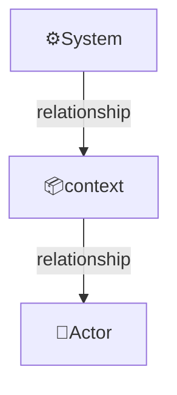
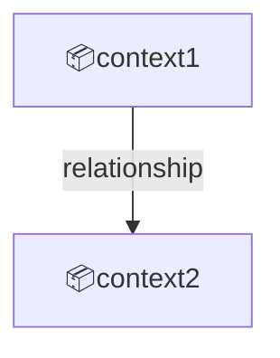

Domain specifications define the target subject area, its external actors, concepts, bounded contexts, and context map.

File: `uspecs/specs/{domain}/domain.md`

Example domains are `prod` and `devops`:

- `prod`: The business logic and customer-facing capabilities of the product - what the product does for its users
- `devops`: development, testing, delivery, deployment, maintenance (monitoring, observability, etc.) aspects of the product

## Structure

```markdown
# Domain: {domain description}

## System

{scope and key features}

## External actors

Roles:

- 👤RoleName
  - Description

Systems:

- ⚙️SystemName
  - Description

---

## Concepts

- ConceptName: definition
  - Sub-concept if needed

## Contexts

### {context-id}

{description}

Relationships:

{mermaid graph showing relationships with actors and other contexts}

---

## Context map

{mermaid graph showing dependencies between contexts}
```

Relationships example:



Context map example:



## Rules

- Emoji prefixes: 👤 for roles, ⚙️ for systems, 📦 for contexts
- Contexts section: each context is an h3 with description and Mermaid graph showing relationships to actors, systems and other contexts
- Context map: use Mermaid graph showing dependencies between contexts
- Concepts section: domain-specific terms that need definition for shared understanding

## Examples

For prod domain example, see [example-prod.md](./example-prod.md).
For devops domain example, see [example-devops.md](./example-devops.md).
