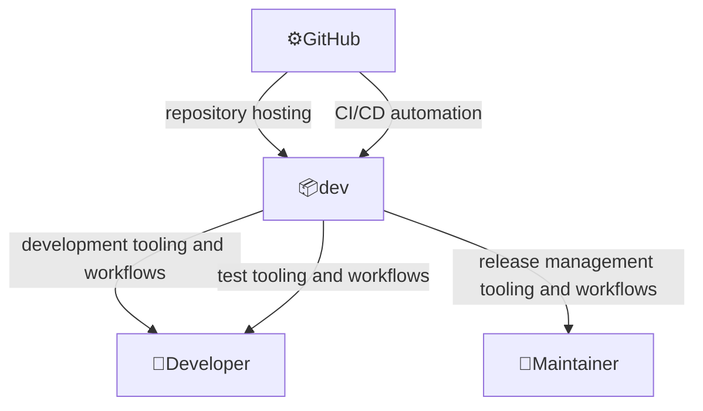
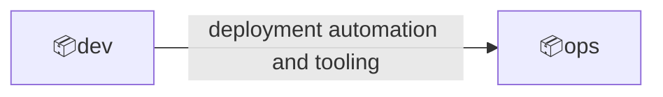

# Domain: Development and operations

## System

Tools, scripts, and configuration files to assist with development, testing, deployment, and operations.

## External actors

Roles:

- 👤Developer
  - Modifies codebase
- 👤Maintainer
  - Makes releases

Systems:

- ⚙️GitHub
  - A platform that allows to store, manage, share code and automate related workflows

---

## Contexts

### dev

Development, testing, and release automation.

Relationships:

### ops

Production operations, monitoring, and incident response.

---

## Context map

