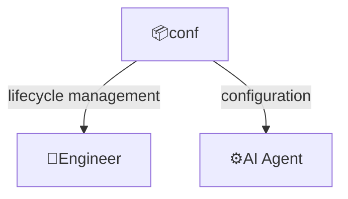
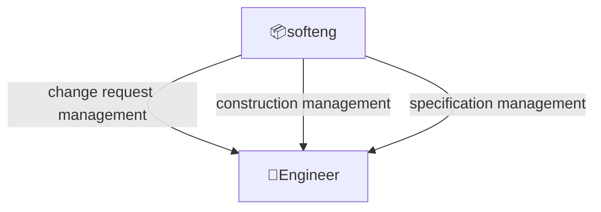
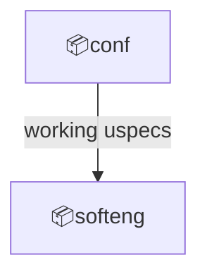

# Domain: AI-assisted software engineering

## System

Scope:

- Tools and workflows to assist software engineers in designing, specifying, and constructing software systems using AI agents
- Supports both greenfield and brownfield projects

Key features:

- Quick design: no per-project installation or configuration required, great for prototyping and experimentation
- Greenfield and brownfield projects support
- Optional simplified workflow for brownfield projects
- Gherkin language for functional specifications
- Maintaining actual functional specifications
- Maintaining actual architecture and technical design
- Working with multiple domains: by default `prod` and `devops`, can be extended with custom domains

## External actors

Roles:

- Engineer
  - Software engineer interacting with the system

Systems:

- AI Agent
  - System that can follow text based instructions to complete multi-step tasks

## Concepts

- Change Request: a formal proposal to modify System
- Active Change Request: a Change Request that is being actively worked on
- Functional Design
  - A functional specification focuses on what various outside agents (people using the program, computer peripherals, or other computers, for example) might "observe" when interacting with the system
- Technical Design
  - The functional design specifies how a program will behave to outside agents and the technical design describes how that functionality is to be implemented
- Construction
  - Software construction refers to the detailed creation and maintenance of software through coding, verification, unit testing, integration testing and debugging

---

## Contexts

### conf

System lifecycle management and configuration.

Relationships:

### softeng

Software engineering through human-AI collaborative workflows.

Relationships:

---

## Context map

