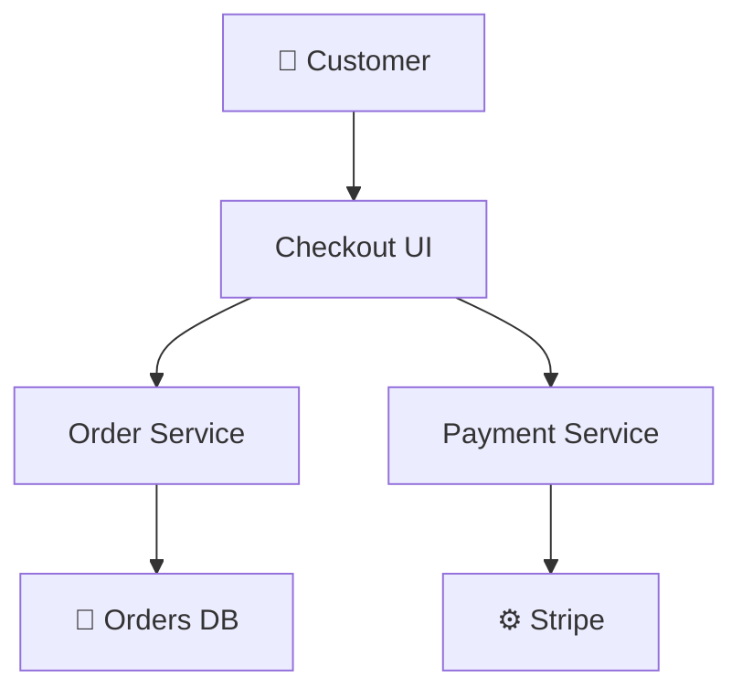
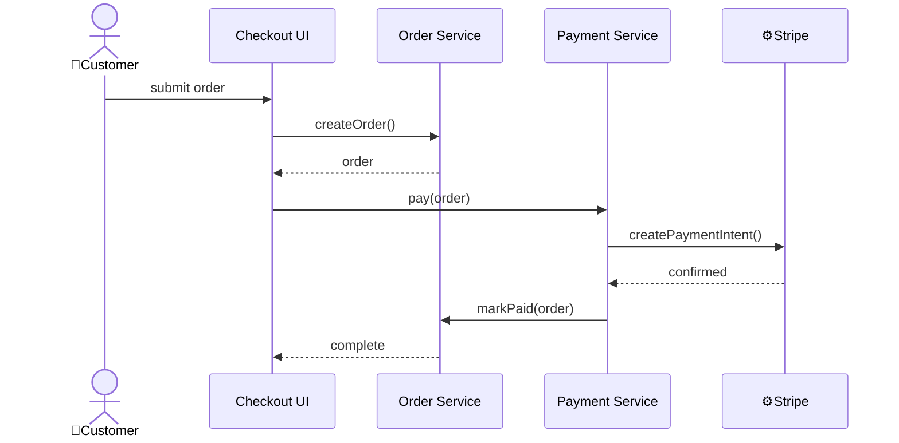

# Architecture document structure

## Principles

- Describe the system at module/service level, not individual classes or files
- Overview: one-line purpose of the architectural scope
- Components: list with one-line descriptions and relative links to implementation files or folders (including planned locations), then Mermaid graph showing relationships
  - Use emoji prefixes: 👤 for roles, ⚙️ for external systems, 📁 for system storages
- Key flows: service-level sequence diagrams, not UI interactions. Max 3 unless requested otherwise
- Key data models: state machines, key enums, domain concepts. ERD only for complex relationships
- Decisions: key architectural choices with brief rationale

## Sections

```markdown
# {Title}

## Overview

{one-line purpose}

## Components

{mermaid graph + one-line descriptions}

## Key flows

{sequence diagrams at service/module level}

## Key data models

{state machines, key enums, ERD for complex relationships}

## Decisions

{key choices with rationale}
```

---

## Example

<!-- markdownlint-disable MD025 -->

# Context architecture: prod/checkout

## Overview

Cart, order, and payment processing for customer purchases.

## Components

- 👤 Customer - places and pays for orders
- [Checkout UI](../../../src/ui/checkout/) - cart management, order review, payment form
- [Order Service](../../../src/services/orders/) - order lifecycle, validation, pricing
- [Payment Service](../../../src/services/payments/payment_service.dart) - payment processing, refunds
- 📁 Orders DB - order and transaction persistence
- ⚙️ Stripe - external payment gateway



## Key flows

### Checkout



## Key data models

- OrderStatus: DRAFT -> PENDING_PAYMENT -> PAID or CANCELLED

## Decisions

- Stripe as payment gateway: widely adopted, good API, handles PCI compliance
- Synchronous payment flow: simplifies order state management, acceptable for checkout volumes
