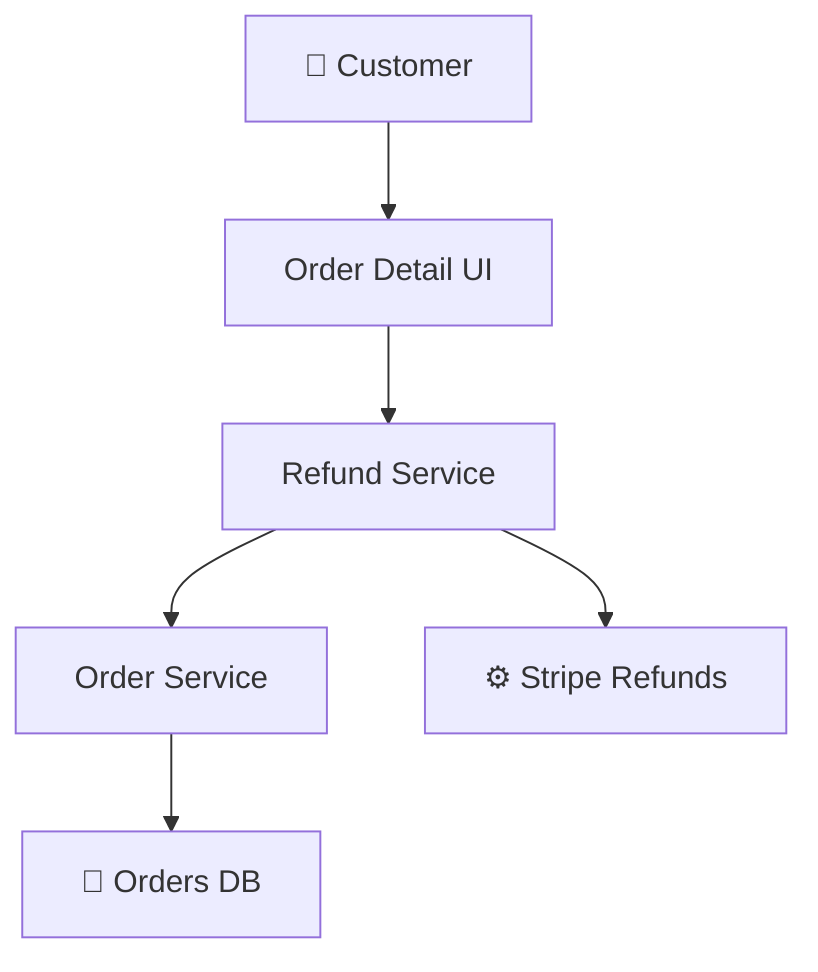
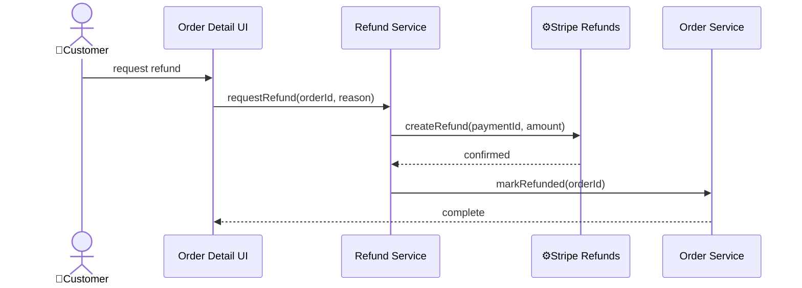
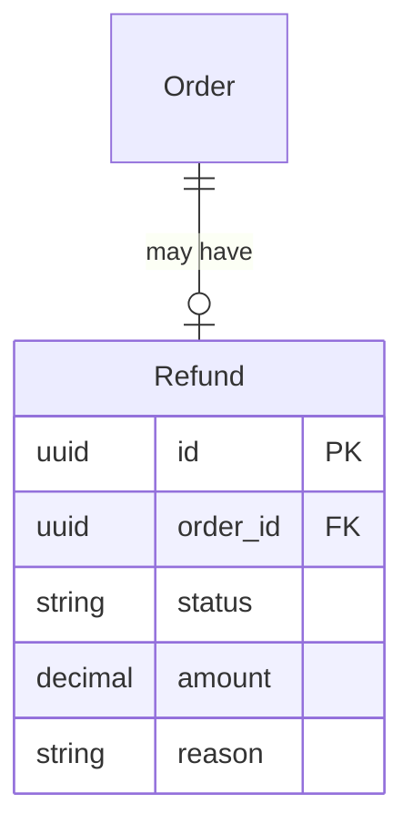

# Feature technical design document structure

## Principles

- Bridges functional design (.feature scenarios) to implementation
- Same module-level abstraction as architecture documents
- Components: list with one-line descriptions and relative links to implementation files or folders (including planned locations), then Mermaid graph
- Each scenario (or group of related scenarios) gets a mini-arch: components, flow, data models -- only what's relevant
- Top-level Components section shows what's in scope for the feature

## Sections

```markdown
# Feature technical design: {feature}

## Overview

{one-line purpose}

## Components

{mermaid graph + one-line descriptions -- what this feature touches}

## Scenarios

### {Scenario name}

{subset of: components involved, flow (sequence diagram), data models -- as needed}

### {Another scenario}

...

## Decisions

{key choices with rationale}
```

---

<!-- markdownlint-disable MD025 -->

## Example

# Feature technical design: order-refunds

## Overview

Allow customers to request full or partial refunds for completed orders.

## Components

- 👤 Customer - requests refund from order detail
- [Order Detail UI](../../../src/ui/orders/detail/) - refund form, reason selection, confirmation
- [Refund Service](../../../src/services/refunds/refund_service.dart) - validates eligibility, calculates amount, orchestrates refund
- [Order Service](../../../src/services/orders/) - updates order status
- 📁 Orders DB - stores refund records
- ⚙️ Stripe Refunds - processes refund transactions



## Scenarios

### Customer requests refund

Flow:



Data models:

- RefundStatus: REQUESTED -> PROCESSING -> COMPLETED or FAILED



### Partial refund

Components:

- Same as above, plus item selection in Order Detail UI

Data models:

- Refund has child RefundItem records per selected item

## Decisions

- Full amount calculated server-side from order data, not passed from client
- Partial refunds create per-item records to support audit trail
